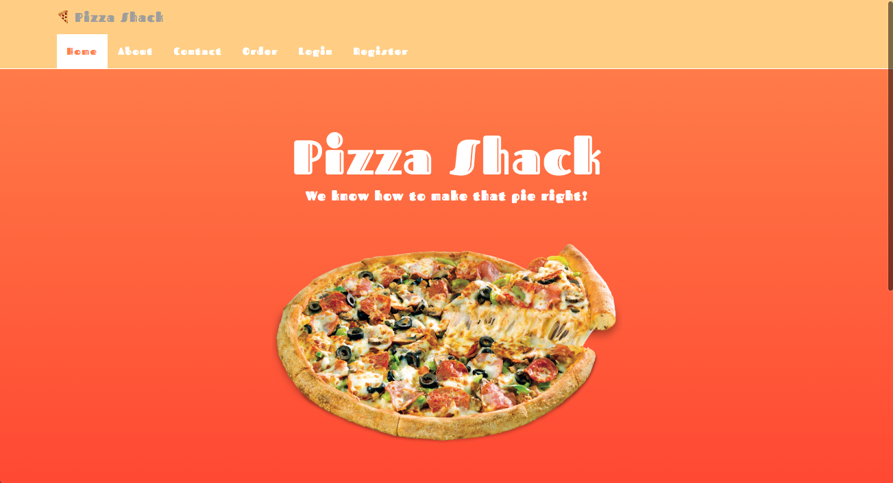
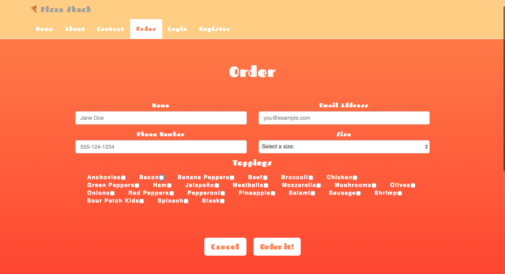
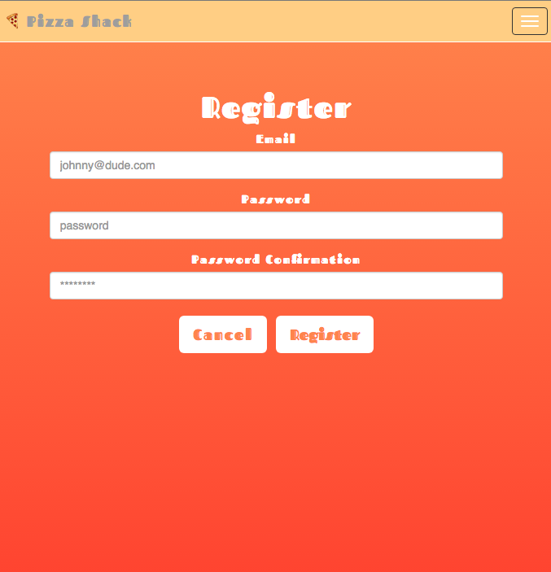

# order-app

Pizza Ordering App is using PostreSQL, Express, Knex, Bookshelf, and Pug Templating [ all the views are rendered server-side ]

Users are authenticated with Passport and bcrypt hashes/un-hashes passwords to and from the database.

   
  
  

